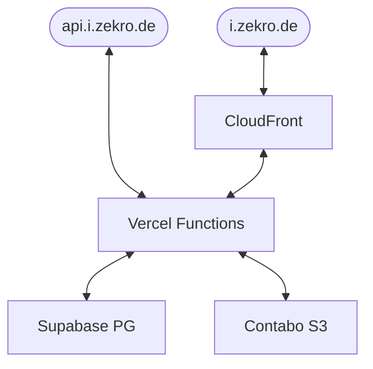

# sharex-backend

My private and very much over engineered, 100% serverless and (almost) completely free [ShareX](https://getsharex.com) image sharing backend.

## Structure

The backend consists of Vercel serverless functions written in Rust (see [handler](handler/) crate) to authenticate and upload, retrieve, list and manage images. The authentication is done via the [OpenID Connect](https://openid.net/connect) flow. In this case, Auth0 is used as authentication server and identity provider. Images are stored in a S3 bucket on Contabo and persistent information like user-to-image links are stored in a Postgres database, in this case hosted on Supabase. To reduce load on the `GET i.zekro.de/:image_id` endpoint, CloudFront is used as proxy cache in front of Vercel functions.

## Motivation

This project is primarily created to learn more about serverless software architecture - especially with Rust, authentication via OAuth2 and OpenID Connect and proxy caching via AWS Cloudfront.

## Todo

Because this project is currently WIP, some features are still missing but planned.

### Authentication

- [x] Login via OAuth2 + OpenID Connect
- [x] Authentication in serverless fucntions
- [ ] Creating API tokens for authentication
- [ ] Using API tokens for authentication

### Images

- [x] Upload images
- [x] Retrieve images
- [ ] List users images
- [ ] Delete images

### Web UI

- [ ] Web UI to list, view and manage images